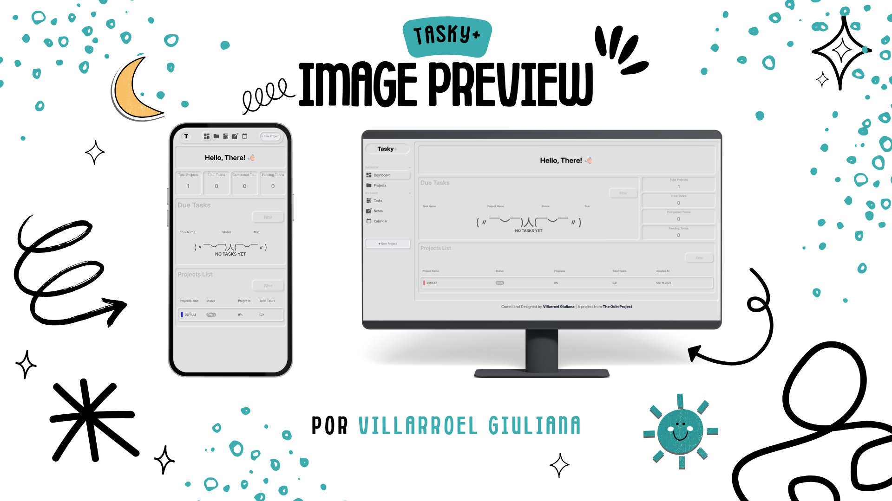

# Tasky+ - Todo App

A modern, responsive productivity app built with vanilla JavaScript, Webpack, and dynamic DOM manipulation. This project demonstrates modular JavaScript architecture with client-side routing, project and task management, and mobile-first responsive design.

## Preview



## 👀 Live Demo

[View Live Site](https://gvillarroel-dev.github.io/todo-app/)

## 📱 Features

- **Dynamic Content Rendering**: All page content is generated dynamically using JavaScript modules
- **Client-Side Routing**: Smooth navigation between Dashboard, Projects, Tasks, Notes, and Calendar pages
- **Project & Task Management**: Create, edit, delete, and toggle tasks across multiple projects
- **Notes**: Independent post-it style notes not linked to projects or tasks
- **Responsive Design**: Mobile-first approach with optimized layouts for tablet and desktop
- **Modern Build Tools**: Webpack configuration for module bundling and asset management
- **ES6 Modules**: Clean, maintainable code structure with import/export syntax
- **Custom CSS**: Hand-crafted neumorphic styles with CSS custom properties and modern layout techniques

## 🛠️ Technologies Used

- **HTML5**: Semantic markup structure
- **CSS3**: Custom properties, Flexbox, Grid, media queries
- **JavaScript (ES6+)**: Modules, DOM manipulation, event handling
- **Webpack**: Module bundling and asset management
- **NPM**: Package management

## 📦 Installation

1. **Clone the repository**

    ```bash
    git clone https://github.com/gvillarroel-dev/todo-app.git
    cd todo-app
    ```

2. **Install dependencies**

    ```bash
    npm install
    ```

3. **Run development server**

    ```bash
    npx webpack serve
    ```

    Open [http://localhost:8080](http://localhost:8080) in your browser

4. **Build for production**
    ```bash
    npx webpack
    ```
    Production files will be generated in the `dist/` folder

## 📁 Project Structure

```
todo-app/
├── src/
│   ├── assets/                  # Icons and static assets
│   ├── events/                  # Event handler modules per page
│   │   ├── dashboardEvents.js
│   │   ├── projectsEvents.js
│   │   ├── tasksEvents.js
│   │   ├── notesEvents.js
│   │   ├── modalEvents.js
│   │   └── dropdownEvents.js
│   ├── modules/                 # Core data models and app logic
│   │   ├── appLogic.js
│   │   ├── Todo.js
│   │   ├── Project.js
│   │   └── Note.js
│   ├── pages/                   # Page render functions
│   │   ├── dashboard.js
│   │   ├── projects.js
│   │   ├── tasks.js
│   │   └── notes.js
│   ├── utils/                   # Shared utilities
│   │   ├── domHelpers.js
│   │   ├── dataFormatter.js
│   │   ├── filterUtils.js
│   │   └── filterControls.js
│   ├── styles/
│   │   └── style.css            # Global styles
│   ├── index.js                 # Entry point
│   ├── router.js                # Client-side router
│   └── template.html            # HTML template
├── dist/                        # Build output (generated)
├── .gitignore
├── package.json
├── package-lock.json
├── webpack.config.js
├── LICENCE
└── README.md
```

## 👩🏻‍🎨 Design Features

### Color Scheme

- **Primary**: `#e0e0e0` (Light Gray)
- **Grey 300**: `#bcbcbc`
- **Grey 400**: `#8b8b8b`
- **Grey 600**: `#535050`
- **In Progress**: `#5676f4` (Blue)
- **Complete**: `#009a5a` (Green)

### Typography

- **Font**: Inter (Google Fonts)

### Style

Neumorphic design system using inset and outer box shadows to create a soft, tactile UI feel consistent across all components.

## 🧩 Key Functionality

### Client-Side Routing

The router renders pages dynamically by calling each page's render function, initializing its event handlers, and running cleanup on navigation to prevent memory leaks.

### Project & Task Management

- Create projects from the header button available on Dashboard and Projects pages
- Tasks are grouped by project on the Tasks page with collapsible sections
- Inline detail rows allow editing, deleting, and toggling task completion without modals

### Filter & Sort System

Shared `filterControls.js` centralizes dropdown filter logic across Dashboard and Projects pages, supporting sorting by status, progress, name, priority, and due date.

### Modular Architecture

- Separation of concerns with ES6 modules
- DOM construction isolated in `domHelpers.js`
- Event handling isolated per page in `events/`
- Business logic centralized in `appLogic.js`

## 👩🏻‍🎓 Learning Objectives

This project was built to practice:

- Modular JavaScript architecture without frameworks
- Dynamic DOM manipulation and event delegation
- Client-side routing with cleanup patterns
- Responsive design with mobile-first CSS
- Git workflow and version control
- Project organization and separation of concerns

## ◉ Deployment

This project is deployed on GitHub Pages:

1. **Build the project**

    ```bash
    npx webpack
    ```

2. **Deploy to gh-pages branch**

    ```bash
    git add dist -f && git commit -m "Deployment commit"
    git subtree push --prefix dist origin gh-pages
    ```

3. **Configure GitHub Pages**
    - Go to repository Settings → Pages
    - Set source to `gh-pages` branch
    - Save and wait for deployment

## 📄 License

This project is open source and available under the [MIT License](LICENSE).

## 👤 Author

**Villarroel Giuliana**

- GitHub: [@gvillarroel-dev](https://github.com/gvillarroel-dev)
- Project Link: [https://github.com/gvillarroel-dev/todo-app](https://github.com/gvillarroel-dev/todo-app.git)

## 🤝 Contributing

Contributions, issues, and feature requests are welcome! Feel free to check the [issues page](https://github.com/gvillarroel-dev/todo-app/issues).

## ⭐ Show your support

Give a ⭐️ if you like this project!

---

**Note**: This project was created as part of [The Odin Project](https://www.theodinproject.com/) curriculum.